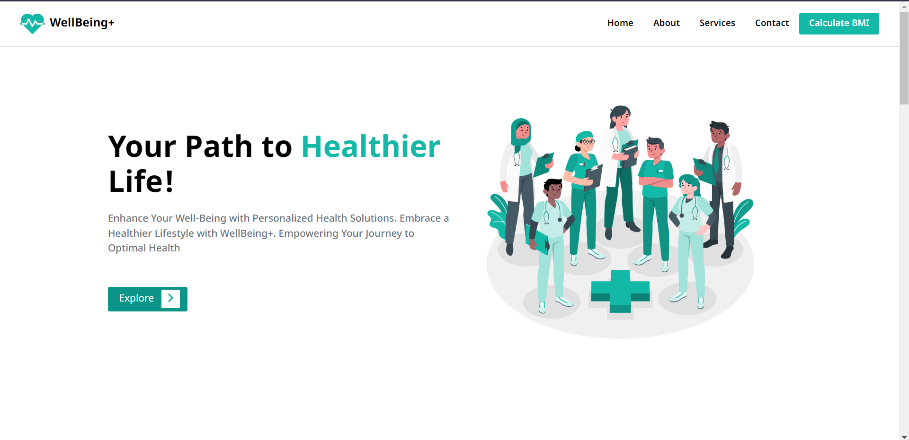

# Wellbeing

## Description

Welcome to WellBeing+ - a comprehensive health and wellness platform designed to empower you on your journey to a healthier life. Our website offers personalized health solutions, expert guidance, and a supportive community to help you achieve your wellness goals. Whether you are looking to improve your physical fitness, manage stress, or make positive lifestyle changes, WellBeing+ is here to guide you every step of the way.

## Live Demo

You can check out the live demo of the website [here](https://www.well-being.netlify.app).

## Features

- Responsive UI
- Clean UI

## Technologies Used

- HTML
- CSS
- JavaScript

## Installation

1. Clone the repository:

`git clone https://github.com/Ayush-Bulbule/well-being.git`

2. Open the index.html file in your web browser to view the website.

## Contributing

If you find any issues or have suggestions for improvement, feel free to open an issue or submit a pull request.
